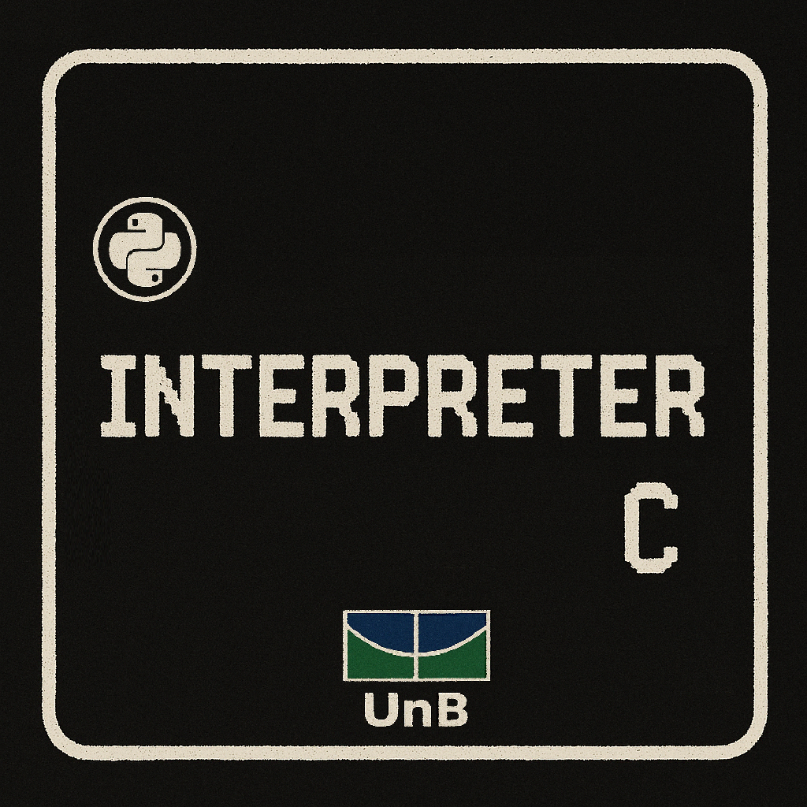

# Documentação Compiladores I - Equipe II

  

# Sobre

Desenvolvimento de um interpretador de C desenvolvido em python como parte da disciplina de Compiladores I, na Faculdade de Ciência, Tecnologia e Engenharia (FCTE) da Universidade de Brasília (UnB).

Utilizamos o repositório para compor nosso projeto final bem como as atividades realizadas na disciplina semanalmente.

<!--

- Montar os tópicos com a equipe de deploy e testes 

# Instruções para iniciar o site localmente (em ambientes X)

### Dependências

- Node.js v20.13.1
- NPM (Node Package Manager)
- PostgreSQL
- Ruby
- Rails
- Docker

-->

# Equipe

Conheça os membros da equipe "II":
                                                                
  

| **📸**    |  |  |  |  |  |  |
|:---------:|:------------------------------------------------------------------------------:|:-------------------------------------------------------------------------------:|:------------------------------------------------------------------------------:|:------------------------------------------------------------------------------:|:------------------------------------------------------------------------------:|:------------------------------------------------------------------------------:|
| **Nome**  | [Felipe das Neves](https://github.com/FelipeFreire-gf) | [Breno Alexandre](https://github.com/brenoalexandre0)  | [Júlio Cesar](https://github.com/Julio1099) | [Lucas Soares](https://github.com/lucaaassb) | [Kaleb de Souza](https://github.com/kalebmacedo) | [Ohavio Araujo](https://github.com/bolzanMGB) |                     

