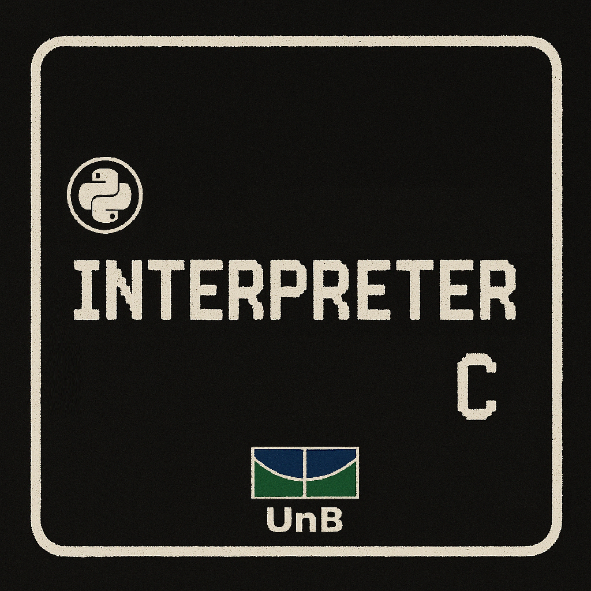

# Interpretador de C desenvolvido em python

   

  

Desenvolvimento de um interpretador de C desenvolvido em python como parte da disciplina de Compiladores I, na Faculdade de Ciência, Tecnologia e Engenharia (FCTE) da Universidade de Brasília (UnB).

 
Utilizamos o repositório para compor nosso projeto final bem como as atividades realizadas na disciplina semanalmente.

 

## Integrantes da Equipe:

<table>
  <tr>
    <td align="center"><a href="https://github.com/FelipeFreire-gf"> <b>Felipe das Neves</b></a> </td>
        <td align="center"><a href="https://github.com/brenoalexandre0"> <b>Breno Alexandre</b></a> 
        <td align="center"><a href="https://github.com/gabriel-lima258"> <b>Julio Cesar</b></a> 
    <td align="center"><a href="https://github.com/lucaaassb"> <b>Lucas Soares</b></a> 
    <td align="center"><a href="https://github.com/kalebmacedo"> <b>Kaleb de Souza</b></a> 
    <td align="center"><a href="https://github.com/bolzanMGB"> <b>Othavio Araujo</b></a> 
  </tr>
</table>

